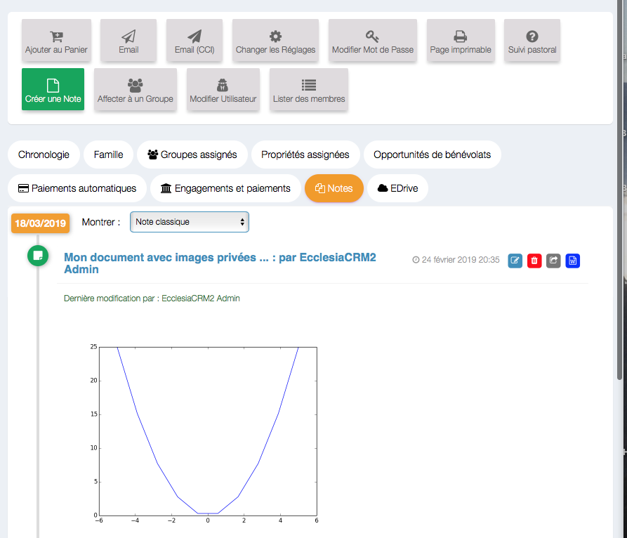
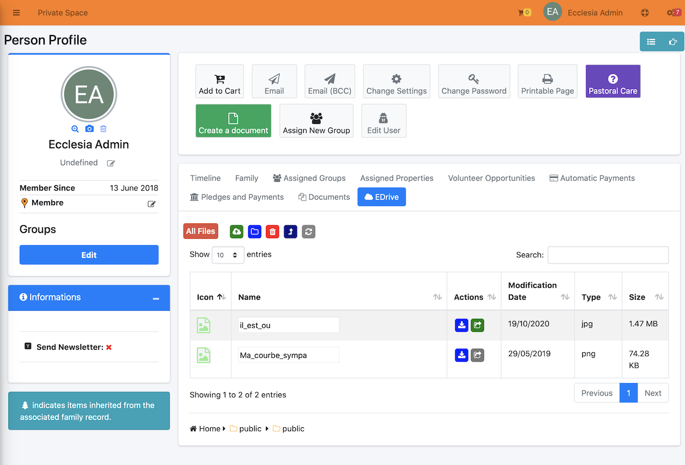

# 
<big>Person & Ecclesia**CRM** </big>

Ecclesia**CRM** gives the possibility to create a member who could be a system user, a family member, or a group member

**NewsLetter** a Family may receive the newsletter.

##One member, an adress

Each individual in the CRM has an adress, the family concept allows an actual adress assignment.

##One member, several roles

Each member of the family has a specific role:

- the family representative
- the spouse
- the children

The family representative is necessary to see a family on a member card

##One member, a classification

- a member
- a prayer group leader

This part can be changed in "people management" and "customization"

##One member, different proprieties

A member has different proprieties which are customizable, such as:

* Un enfant peut être allergique A child can be allergic
* A member can have personnel constraints

This part can be changed in "people management" and "customization"

##One member, a number of groups

A member can be a part of one or more group:

* Of sundaySchool
* Of a prayer group
* Of the elders group

##One member, plenty of custom fields

The custom fields can be add as desired and different for each family.

The custom fields types are:

- Boolean :
- Date    :
- Text type 50 or 100 or infinite:
- Year   :
- Season  :
- Number  :
- Group member :
- Money  :
- Phone number :
- Custom drop-down list :

##One family, funds or automatic payments (only if the member is not a part of a family)

A family can donate and the donation can be claim for the fiscal receipts.

**Rappel** une adresse est un contener ayant des membres. Une adresse sous entend une possibilité de famille.

## Some notes

A family can keep some notes, which are exportable to Drive

## A EDrive

One can go see the part " user manual" and "EDrive in the CRM"
