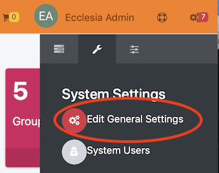
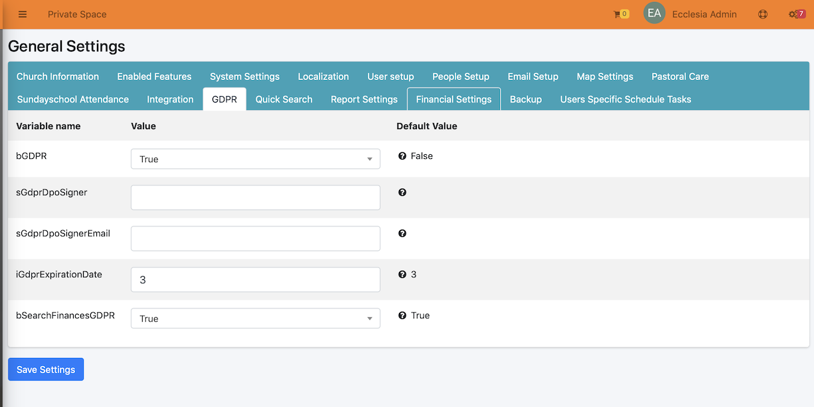
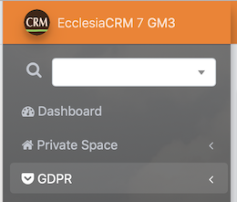
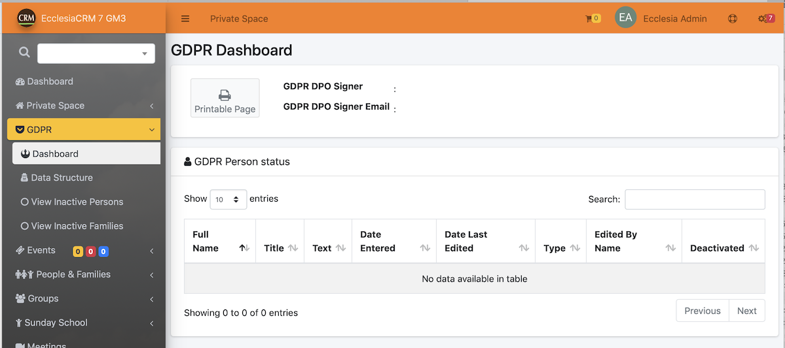
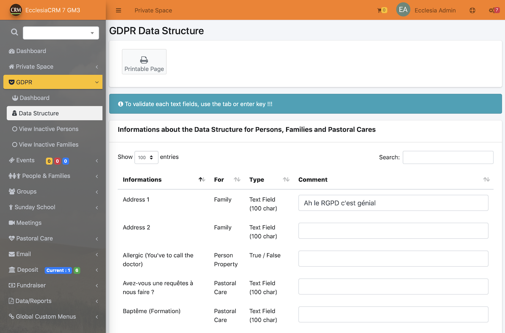

Once the RGPD activated Ecclesia**CRM** will need a final setting made in CA with the DPO in order to answer better the legislative requirements of each EU country.

## Activation

During a new installation each question is asked during the process.
It is also possible to answer later, to this end go to: 

Then choose the RGPD tab: 

- bGDPR : Allows to activate it or not
- sGdprDpoSigner : the name of the DPO
- sGdprDpoSignerEmail : its email adress 
- iGdprExpirationDate : The period of time until the deactivate member will be under the DPO management.  

Once the option is activated a new menu will appear

  
## RGPD Menu

- Follow-up: each manipulation is saved in order to record the modification made by a supervisor

- data structure 

Each part of the data structure has to be explained via the comments.  

**Warning** : Each CRM field, each property will appear there and will be commented. 
A comment is validated via the ENTER key. 

- Members and families deactivated 

The deactivation is applicable only after a certain period of time: as mentioned in iGdprExpirationDate. 

**Warning** : a member that would have made donation must not be erase from the system, for tax purposes. 
