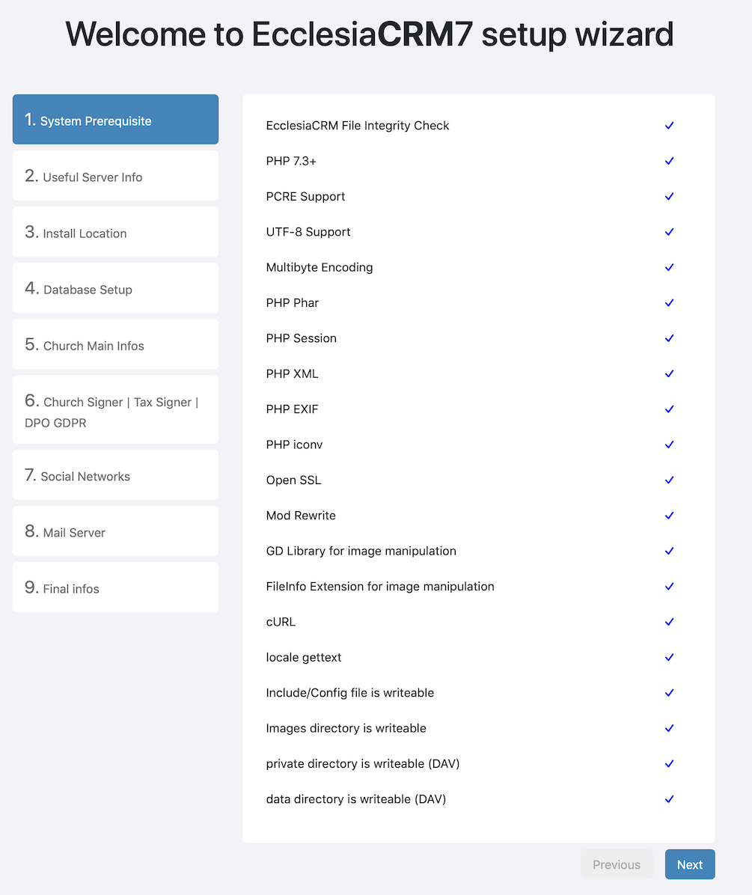
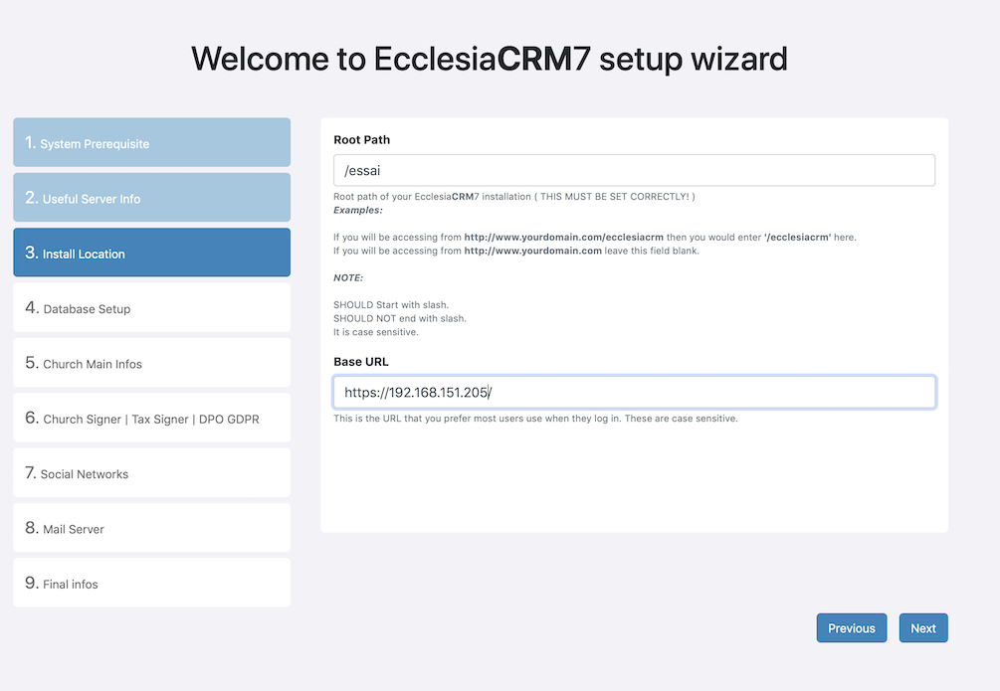
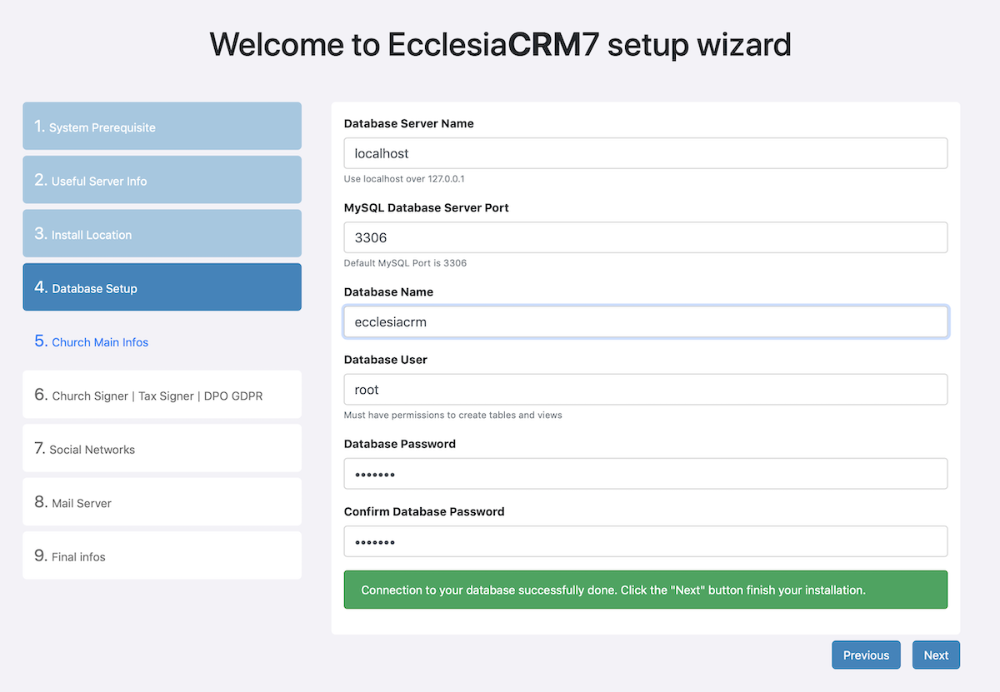
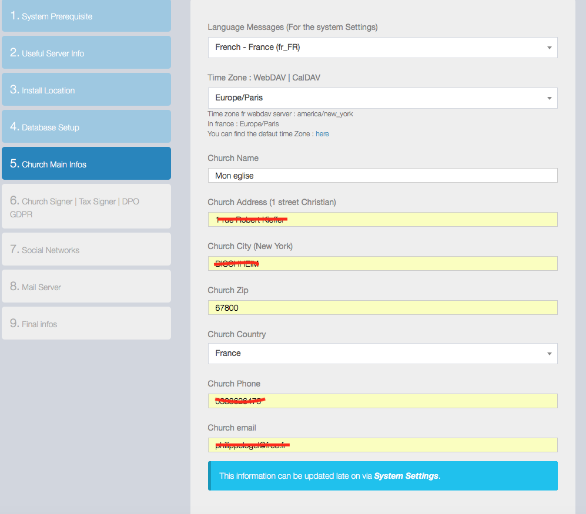
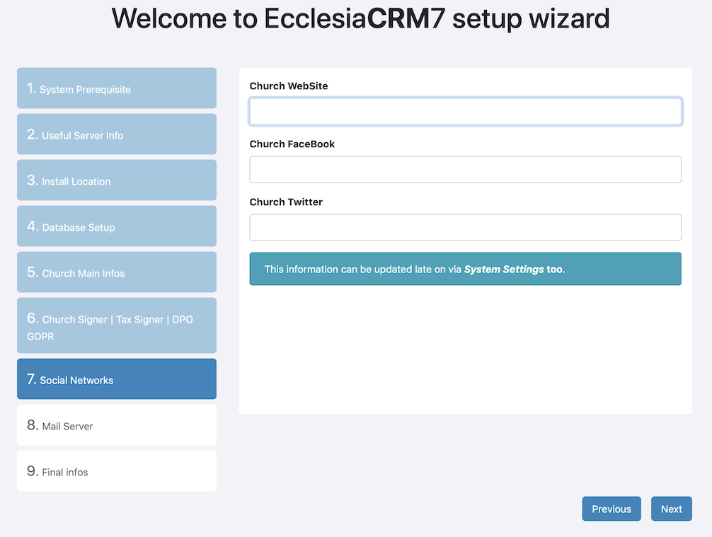
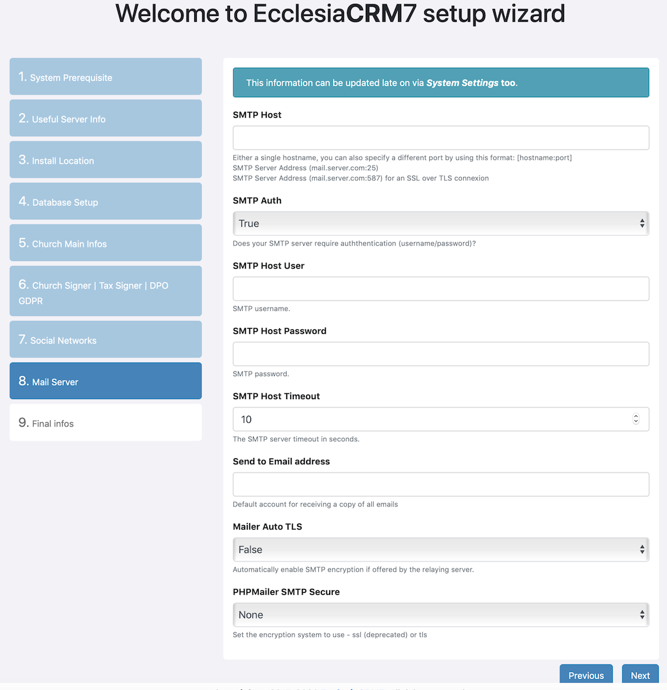
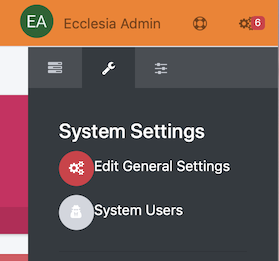
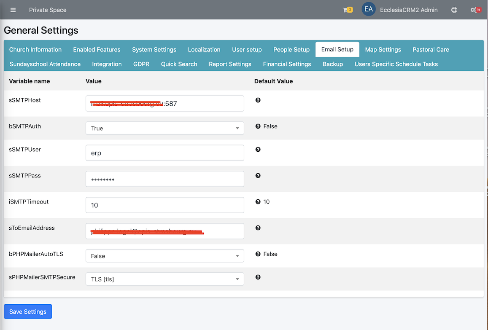
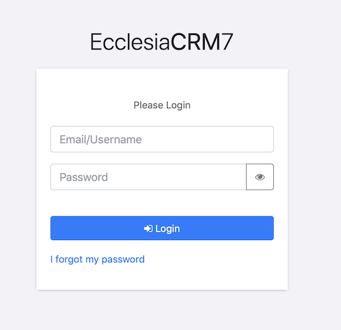

## Installation
* Download the archive on git
* then copy the files on the server 
* and the installer will guide you 

##Be aware of the required elements 

  
  
##Then

  
  
##Here one will be able to set the path if it is non-standard

  
  
##One can use the localhost or choose the server name with a communication port
  
  

* The name of the data base is to be entered 
* As the user's name and password (twice) 

one will be able to test the connectivity to the datat base by clicking on: "here" 

  
  
They can access the data base and go on with the process 

## importante informations

  

Here one will set: 

* The language of the CRM : 
* The time zone (key for the Drive) 
* The rest of the setting is standard 

## Legal informations

  
  
* The person legally responsible for everything that is done on the CRM (Confirm Signer) is the pastor 
* The person legally responsible for the reminders of everything done on the CRM (Confirm Signer) is the pastor
* the Tax signer would be the treasurer 
* DPO GDPR Signer is the supervisor of all the stored data in the CRM 
* The email adress of the DPO 

##The rest is more standard

  
  
##The set up of the email connection 

The email management is key in the CRM since each action is likely to send an email

* modify an account or deactivate it 
* add some member to an event in the calendar
* etc ....

  
  
**Note** It is possible to set the settings later on, go on "general settings" and then "email" 

  

  
  
* one can set the server adress with the communication port, as on the tool tip 
* hey will ask an authentification
* user's name 
* password
* connection period 
* email adress 
* For PHPmailer the settings may be in TLS (if the server connection is made in https).

  
## First connection's settings

  

  
* One will end up on the home screen 

  
  
  The login is       : admin
  The password is : changeme
  
* The user will be ask to change his password during the first connection
