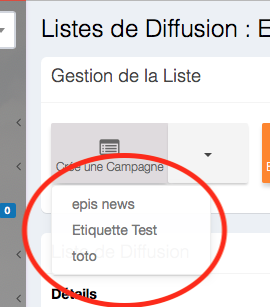
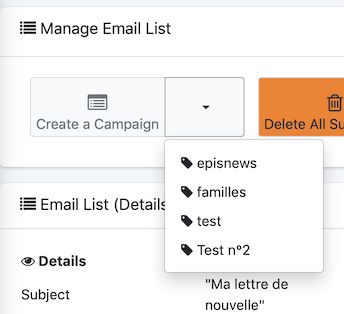
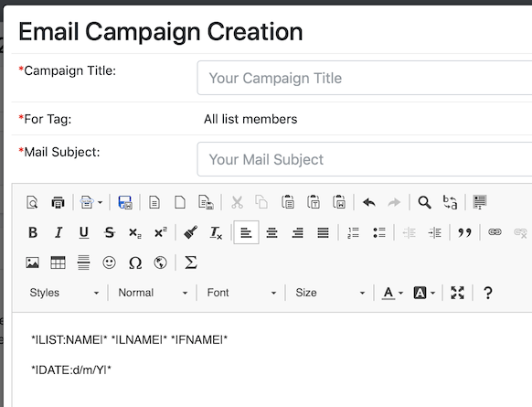
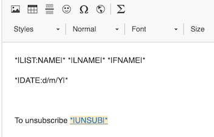
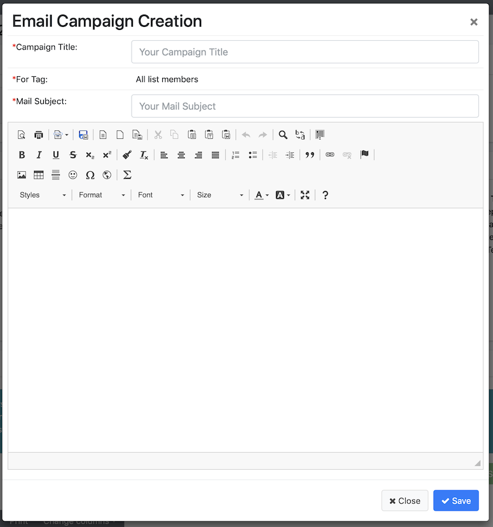
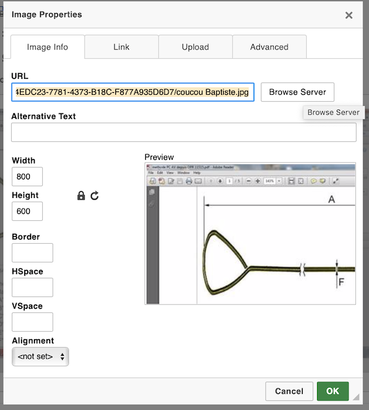
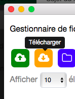
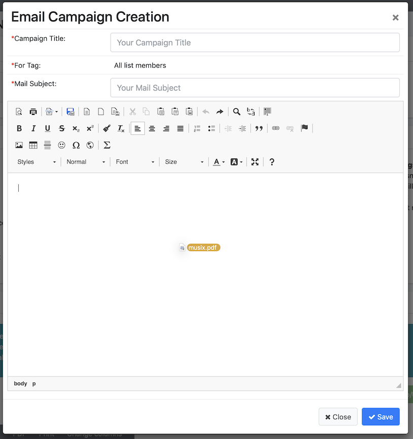
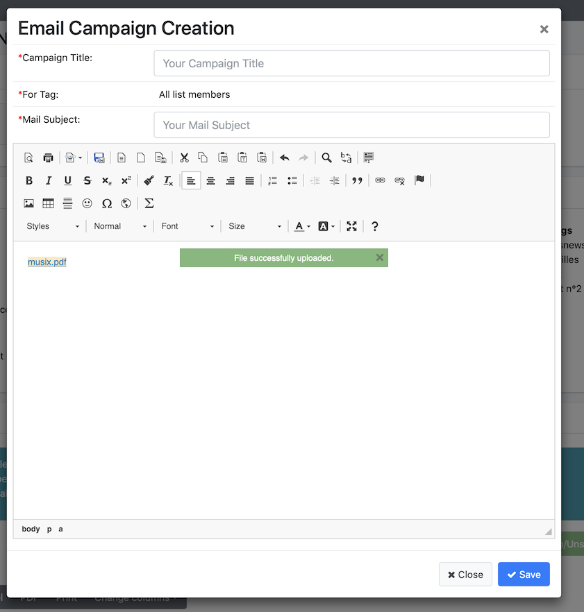
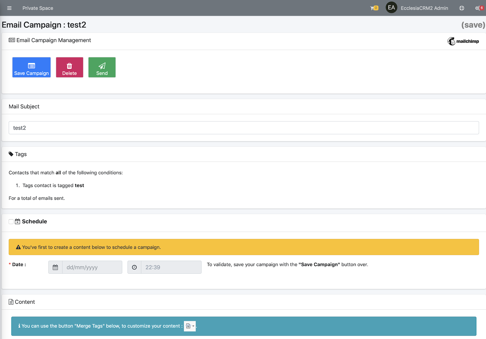

# <center><big>Campaign management Ecclesia**CRM** </big></center>

**Warning** about the image management, the manager of the file has to point on the public file

Because every image inserted in the campaign has to have public link (and not private)

##Create a campaign

Click on the following button or select each member without tags


Or select a tag



then one will be able to create the body text of the campaign



One can now select the campaign's title and the email's object

##Management of a standard email (code field: mailing)

It is now possible to use Mailchimp code Fields, which can make standard email


The following example shows the FNAME, LNAME and the creation date of the email



When the campaign is sent the FNAME and LNAME of each user will be substitute to the code field.

- One can create an unsubscribing link with the mailing list<br>
To this end, one has to use a code field<br>
 <br>
Wich results in<br>
<br>
Then selects the link````*|UNSUB|*```` et on utilise le bouton <br>
 <br>
and<br>


And click on "ok"

**Note** in the general settings, it is possible to add the adress and phone number of each user.


##Insert pictures or documents


- Drop them in the text zone
<br>
The image's link is public
<br>
You can change the size
- With the file manager<br>
<br>
dialog box<br>
<br>
Click on "browse the server"<br>
<br>
then the file manager<br>
<br>
One can download a picture with the server<br>
<br>
And selects the file to drop<br>
<br>

- And dropping a file is possible in an email too
<br>
Here's the attachment file<br>
<br>

Once the campaign is done, one can "save" it

##Plan the mailing

Save the campaign and one will be on the sending page

<br>
<br>
Here one will be able to sava, send, delete or fix a date and a time for their campaign<br>
<br>

It is possible to modify it later too.

**Note**It is advised to create a bank of documents to use them later, to do this one has to go to "document bank", and "user guide", then "documents"
