It is possible in the 5.0 d'Ecclesia**CRM** and higher, to manage the files with a file manager

EDrive has a public and a private part, which are two different files and which:

- allows a clair link in the public part ( for MailChimp, for documents and images, files and to share a file to a person who is not a CRM user)

- in other cases the files have an url which will only be valid during the connection

##See all the events on one's EDrive

1. to this end go to one's personal space

2. click on the tab EDrive

3. Or one can also access as following:

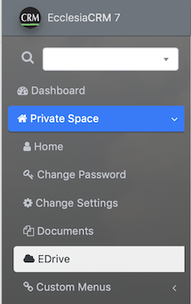

By default, every user has a public file ( key for Mailchimp).

This file can be use to add images or documents to one's mail campaigns.

##Add a file to one's EDrive

1. to this end click on the icon 
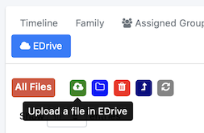

2. A dialog box will open 

3. One will be able to download the files on the server in one's personal space 

4. Choose the files 

5. they are displayed 
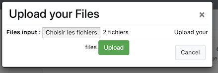

6. Then they will be on the server 
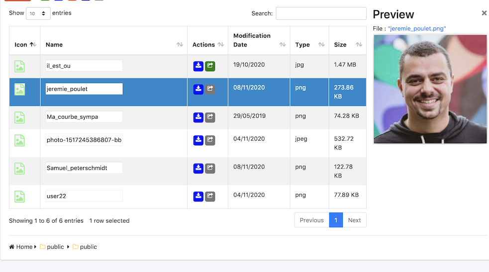

**Notes**

The public file is used here:

##Display the file content

EDrive is a real drive, click on the line:

- For a PDF file 
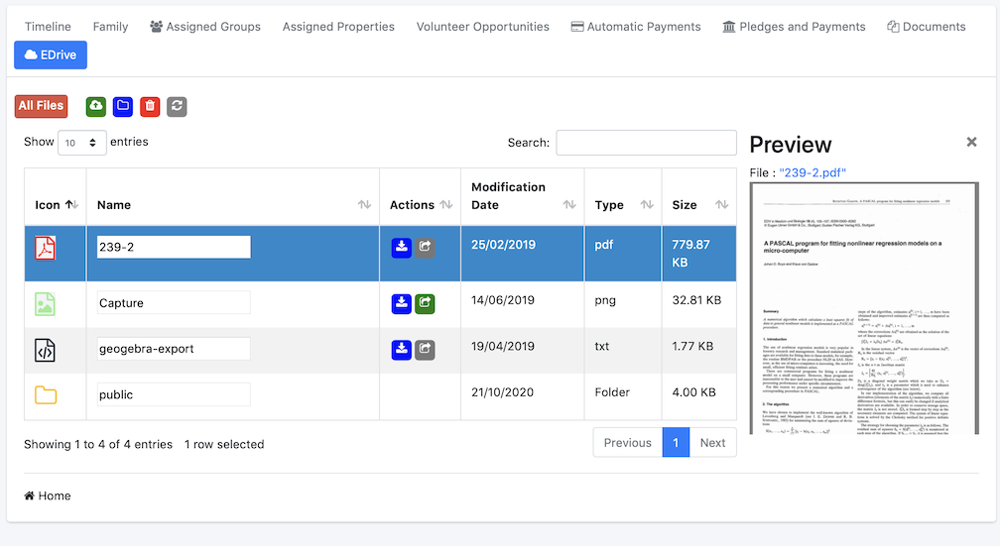

- For an image file 
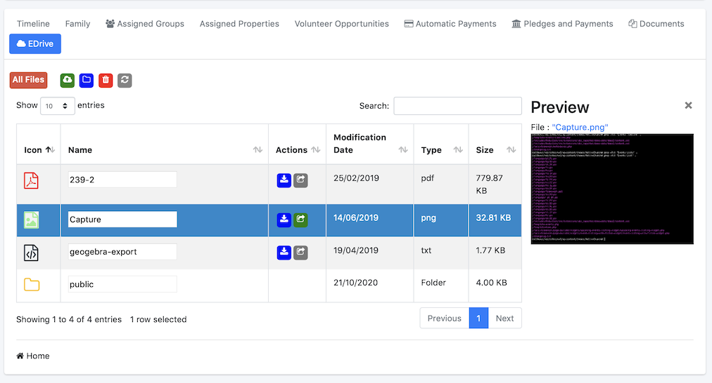

- Then one will be able to preview the videos or mp3 files

##Create a folder

the steps are simple:

- click on the button 
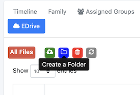

- enter the name of the file wanted 
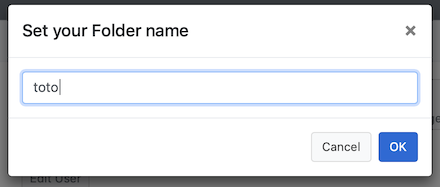

- And it will be on display 
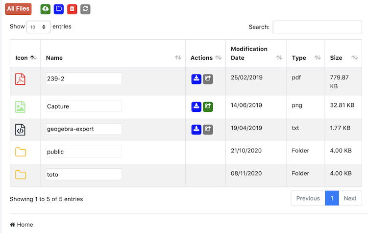

##Change the name of a file

- double click on the file's namer 
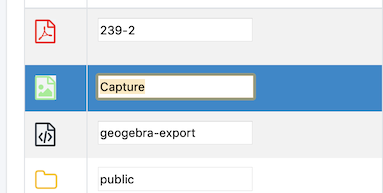

- Enter the new name 
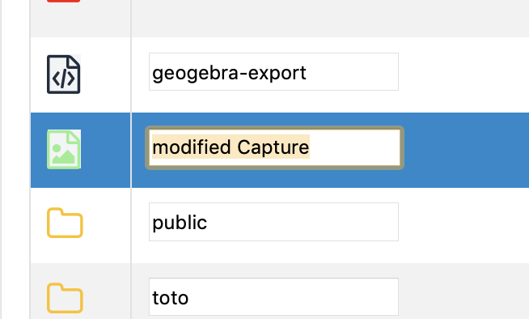

- Click on "enter" 
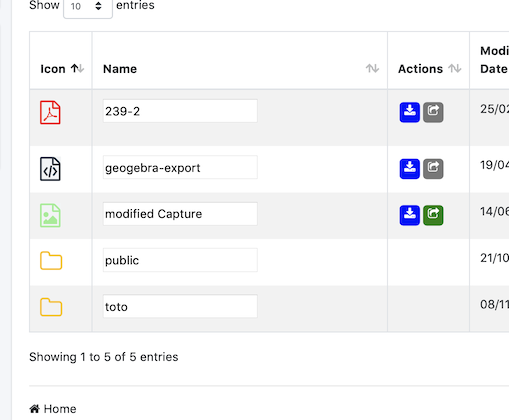

##Move a file in a folder

- Select the icon and move it in the wanted folder 
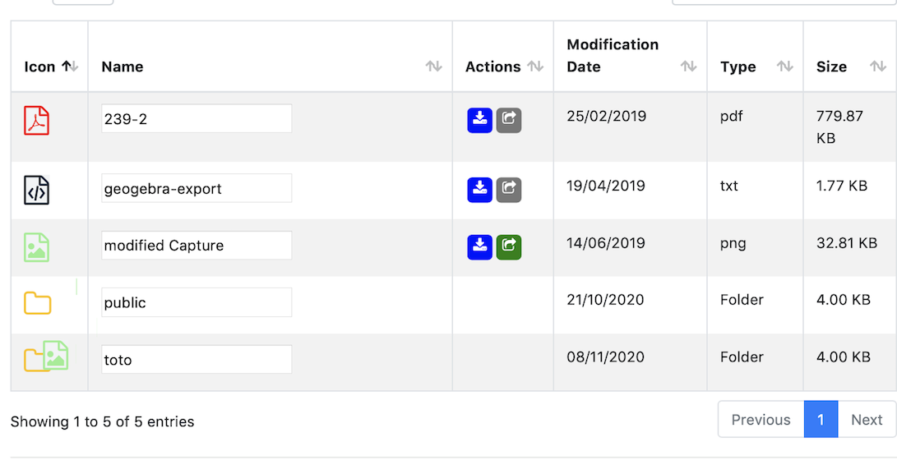

- the drop is done 
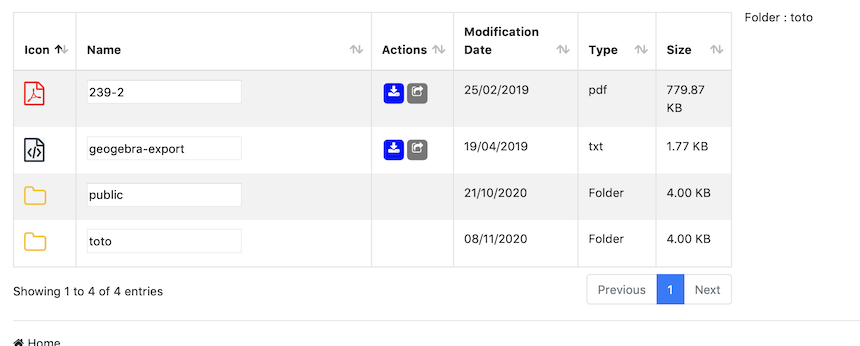

- To go to the wanted folder, double click on the icon of the folder 
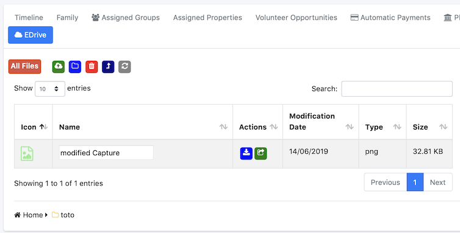

##Come up from a folder

click on the following icon:  

##Come up a level a file in the parent folder

Drag and drop the icon of the file or folder on 

The file or folder will come up in the parent folder

##delete an element

Two options:

- Click on the element and drag and drop in the Recycle bin 

- or one clicks on 

To conclude, it is a complete file manager

EDrive is also via Webdav, like NextCloud or OwnCloud .... EcclesiaCRM is also Cloud.
