The EcclesiaCRM version 5.5.0 or higher allows to deal with the text zones in one's documents

- The drag and drop of images
- the box of image and link management are now integrated to EDrive

To this end:

##Create or edit a document

1. Open a document, CKEditor

- Go to a personal space

2. Add a document

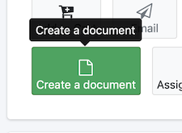

##Edition

Click on the icon:

##Drag and drop images

Once the document is opened drag and drop the image in.

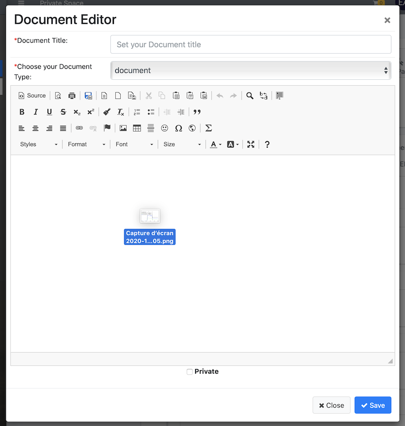

Here's the result:

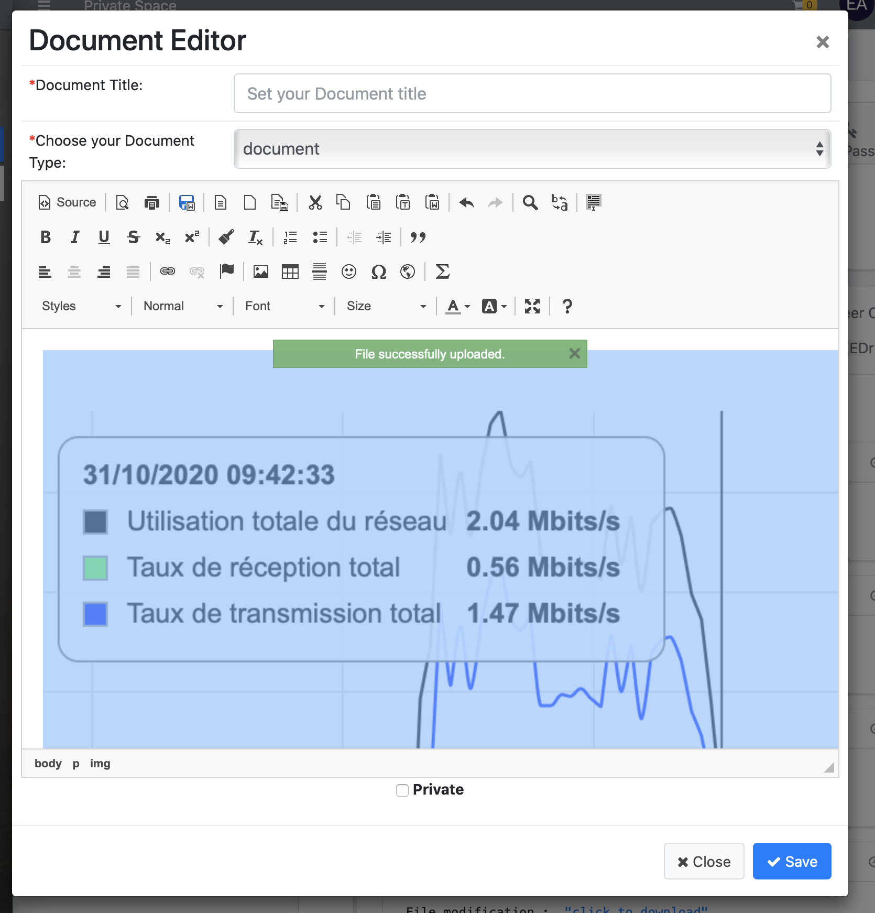

The file is in Edrive if it is activate  (*)

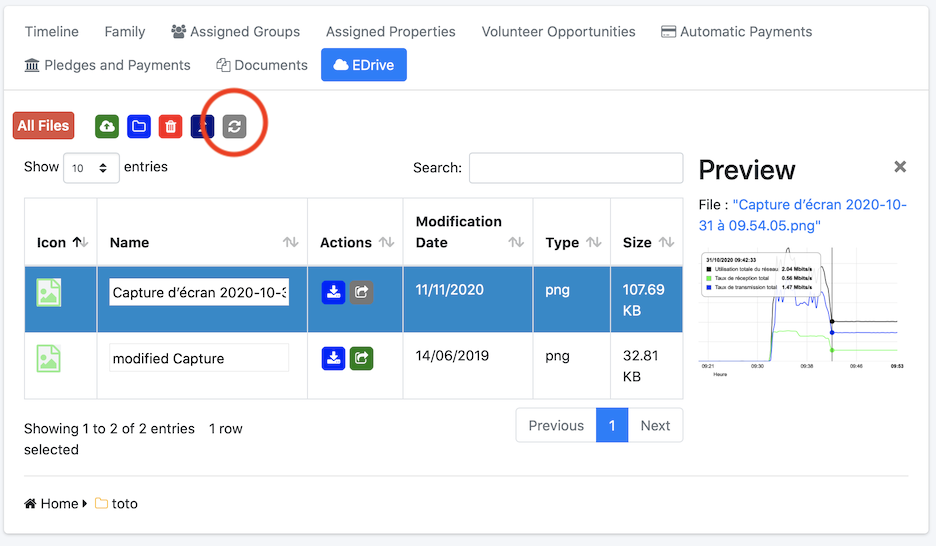

**Note** one can update the drive with the button above

##Drag and drop the files

Once the document is opened drag and drop the files in.

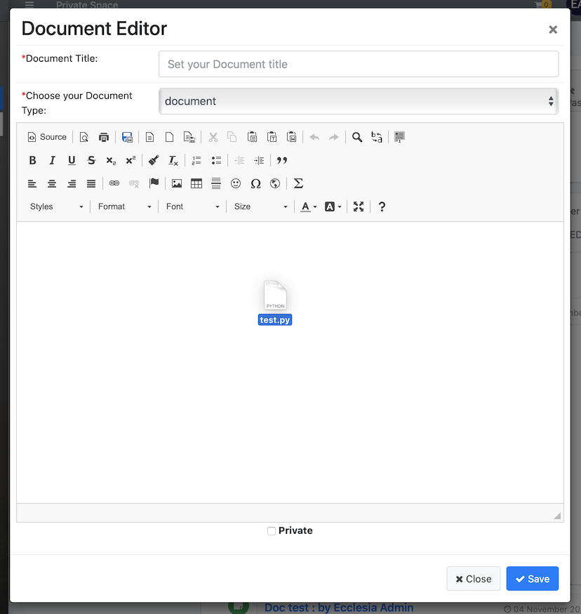

here's the result:

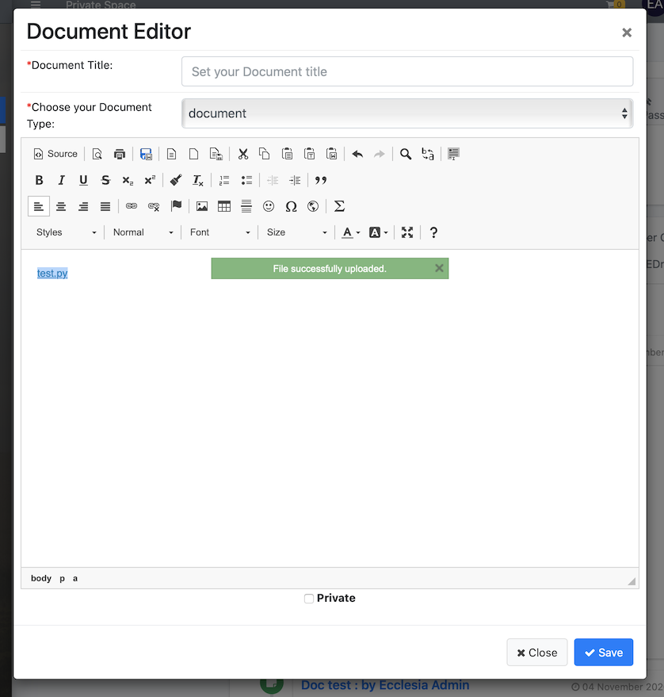

The file is in Edrive if it is activate  (*)

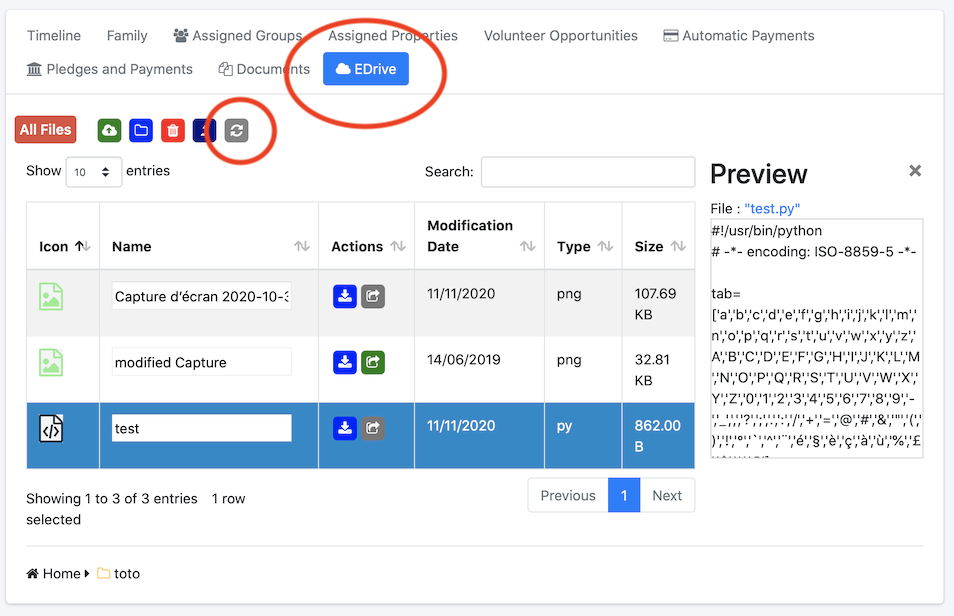

**Note** one can update the drive with the button above

##Include photographs in EDrive (*)

Select:

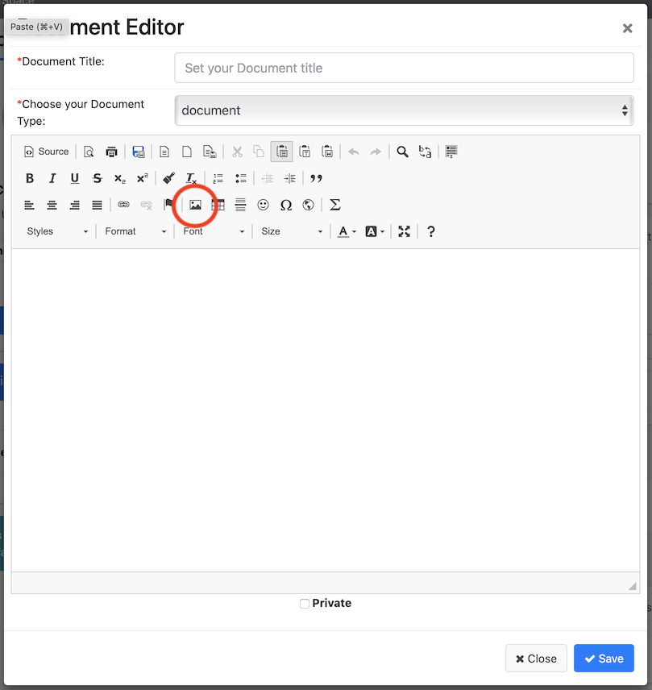

then click

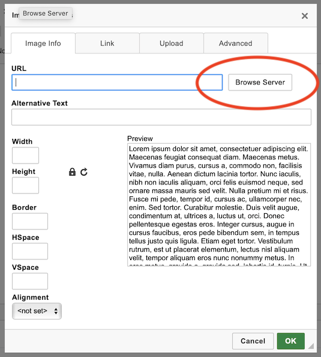

choose the line:

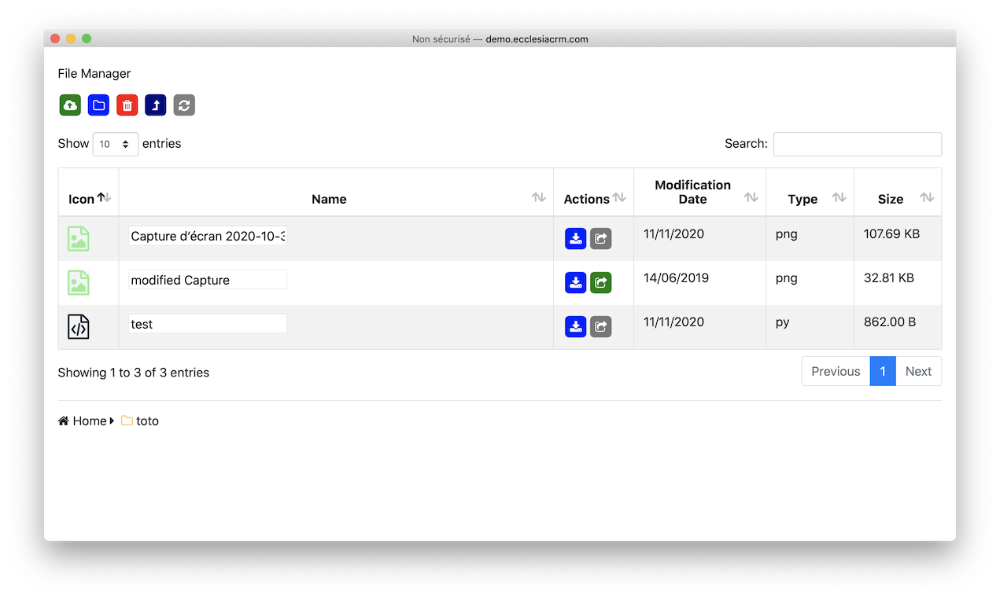

And click on the icon

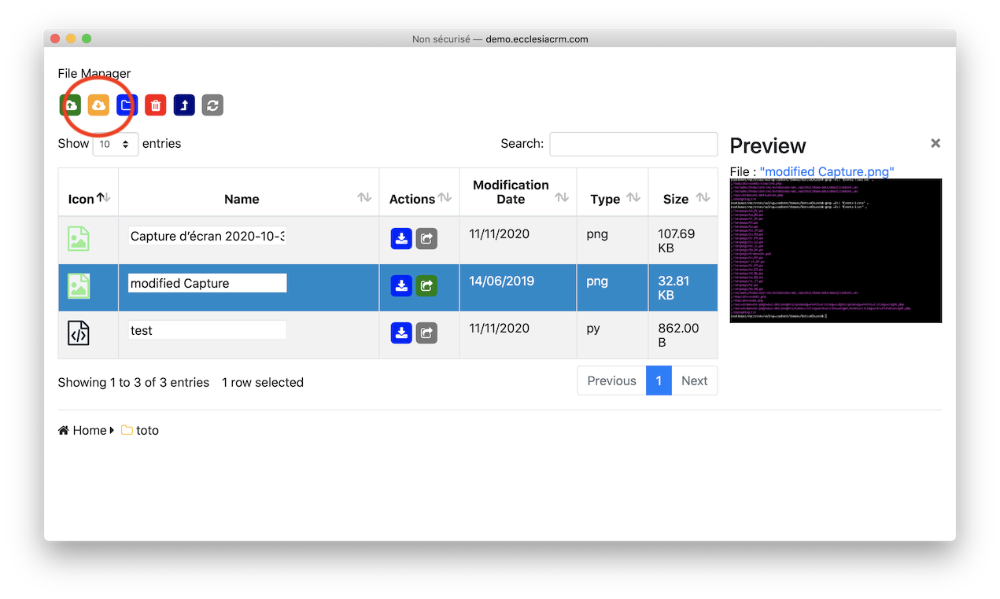

One can manage all the standard settings on CKEditor. The link is dependent on an API (**)

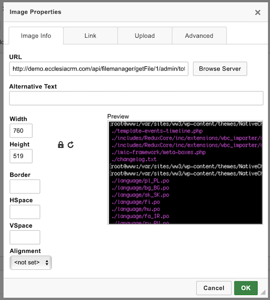

Here's the result:

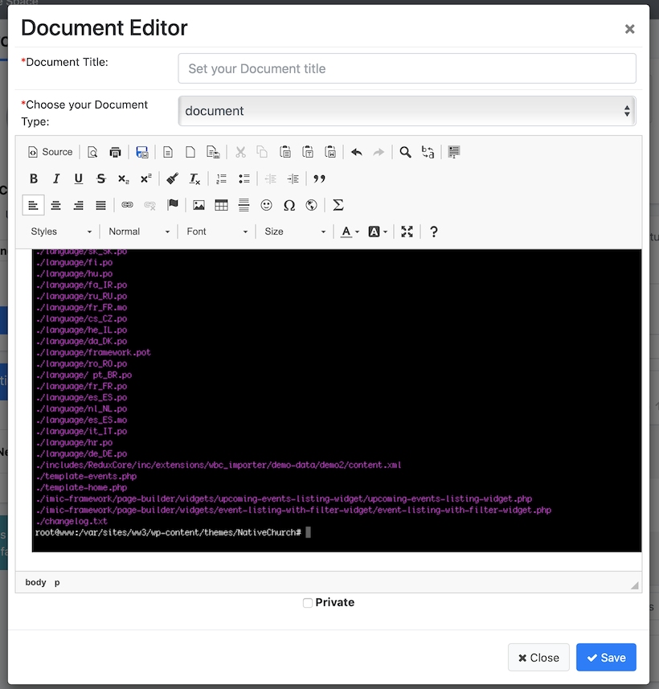

##Include files in EDrive (*)

To this end select:

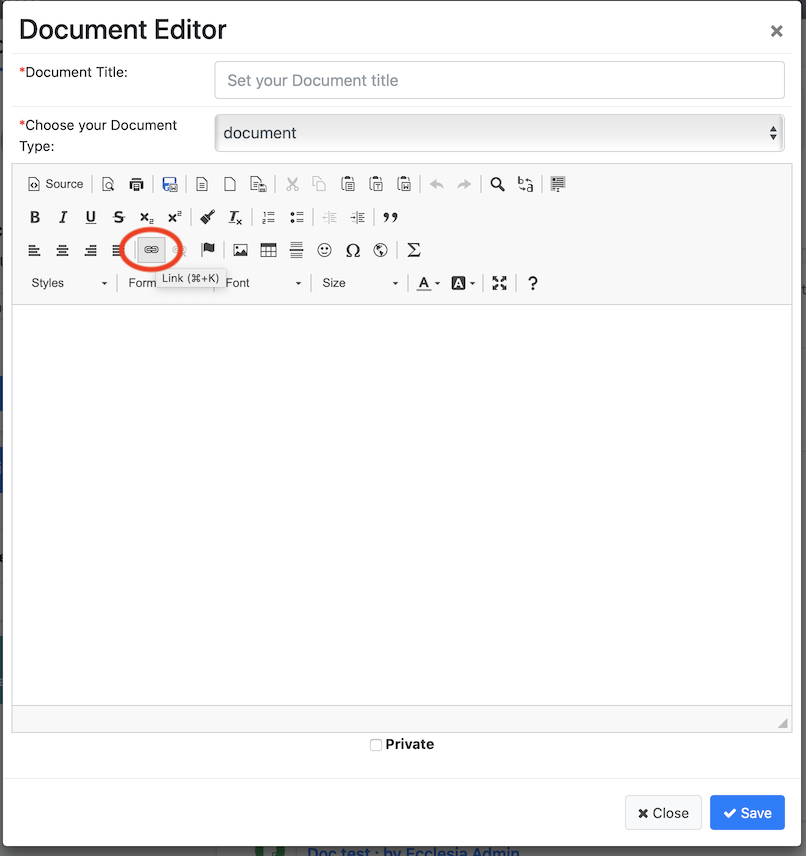

Then click

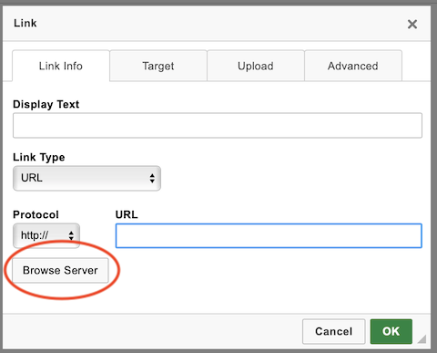

Choose the file in EDrive, the result will be:

One can choose here the name of the link on the page. The link is dependent on an API (**)

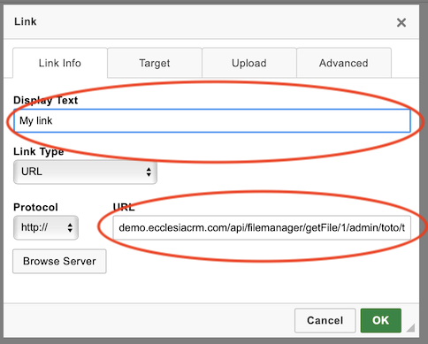

here's the result:

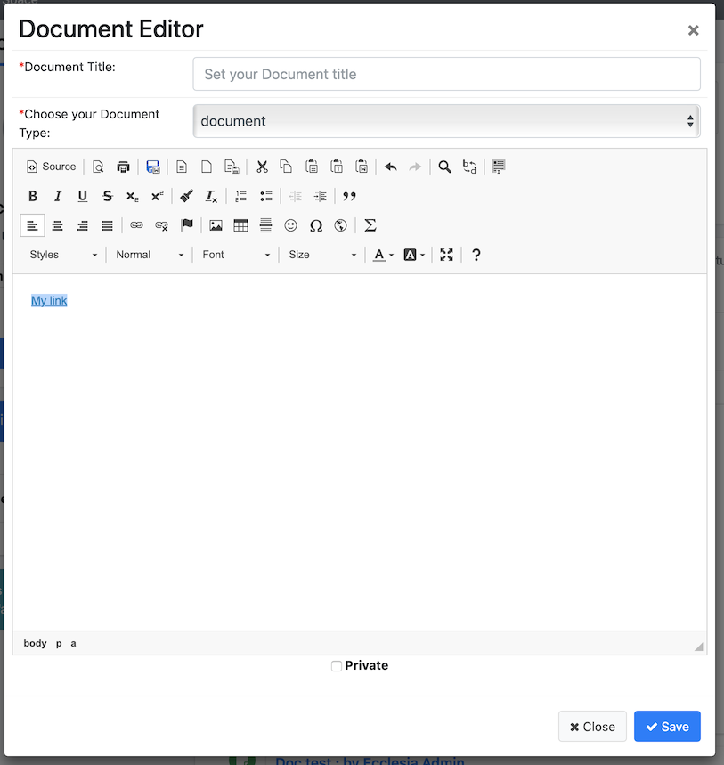

**Note**

(*) To active the EDrive, go to "system settings" -> "user system"

Then edit the user and add the role

(**) The link to the document are via an API, except if the document is in public

In this case, the links are clear ( useful for Mailchimp or to share a document to someone who is not a CRM user)
