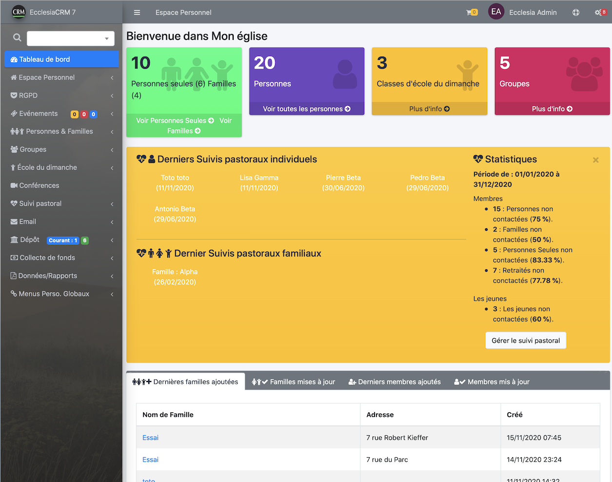

# 
<big>Ecclesia**CRM** documentation</big>

----

## CRM

Ecclesia**CRM** est un CRM (Customer Relationship Management).

## Vue d'ensemble

[EcclesiaCRM](https://www.ecclesiacrm.com) est basé [ChurchCRM](http://churchcrm.io/) qui lui même est basé sur InfoCentral.

Le logiciel a été développé par une équipe de volontaires, dans leurs temps libre, pour proposer aux églises et avec une très grande qualité un logiciel libre.

Si vous voulez découvrir davantage ou aider au développement de l'application, allez sur notre repo [github.com](https://github.com/phili67/ecclesiacrm).

---

## Comment démarrer avec EcclesiaCRM?

Démarrer EcclesiaCRM n'est pas très complexe si vous avez une expérience des Web Applications. Sinon, il y a quelques pré-requis pour bien démarrer. Il est très important de comprendre qu'EcclesiaCRM est une application basée sur le Web, ce qui implique qu'il y a deux aspects à saisir :

Le "serveur", sur lequel l'application tourne. EcclesiaCRM tourne sur une machine distante qui stoquera pour vous les fichiers et les informations que vous avez besoin

Le "client", interagit via un navigateur internet avec l'application distante.

Il n'y a qu'un seul serveur, mais il peut y avoir un nombre illimité d'utilisateurs.

---

## Installation

EcclesiaCRM est une application PHP/MySQL qui tourne sur un serveur web, qui fournit des pages web, les utilisateurs peuvent donc accéder aux données fournies par une base de données.. Il est possible d'accéder aux données en étant sur le serveur lui même via un navigateur, mais la réelle puissance se fera quand vous travaillerez à plusieurs et de manière distante sur cette application web.

## Pour obtenir de l'aide

Pour obtenir de l'aide sur EcclesiaCRM, utilisez le site suivant [problèmes](https://github.com/phili67/ecclesiacrm/issues).

---

## Pour bien démarrer

L'application est basée sur le concept de membres appartenant à des familles et également membres de groupes ayant les mêmes centre d'intérêt.

Après l'installation d'EcclesiaCRM et que vous vous serez connecté pour la première fois, vous serez de suite prêt à configurer l'application.

La première chose à faire sera de saisir le nom de l'église, son adresse, son téléphone, et l'adresse mail dans la partie Rapport.

EcclesiaCRM affichera “Mon église” en gras au entête de chaque page.

---

Durant l'étape de configuration, posez-vous et dîtes-vous comment dois-je utiliser EcclesiaCRM :

1. Quels sont les groupes que je vais avoir besoin ?
2. Quelles sont les propriétés que je veux enregistrer pour chaque membres, familles et groupes ?
3. Avez-vous besoin de champs personnalisables 
4. Qui a réellement des attributs administrateurs ?
5. Qui doit gérer l'aspect financier de l'application ?
6. Qui peut ajouter ou modifier des enregistrements ?