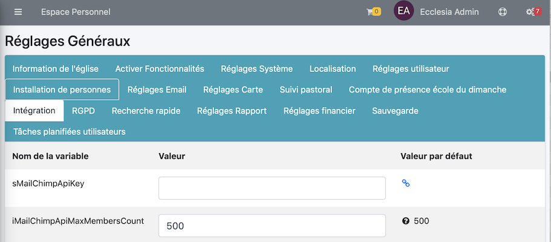

Ici vous pourrez régler les paramètres d'intégration avec d'autres applications

- MailChimp
- Les outils permettant d'intégrer les calendrier externes d'EcclesiaCRM.
- La gestion externe de DAV

## Comment y accéder ?

Aller dans :

Puis sélectionner l'onglet : "Intégration"

Il y a plusieurs pôles possibles, la plupart du temps les bulles d'aide sont claires et suffisantes.

## MailChimp : "bEnabledDavWebBrowser" & "iMailChimpApiMaxMembersCount"

MailChimp est un outil de publipostage complètement intégré à EcclesiaCRM. Pour obtenir une clé d'activation gratuite aller dans le lien ci-dessous.

[MailChimp](https://mailchimp.com)

Une fois la cél obtenu, il sera possible de la saisir dans : **bEnabledDavWebBrowser**

**Remarque ** L'api MailChimp pose parfois des problèmes quand un trop grand nombre d'utilisateurs est lié à une liste de diffusion.

Il est possible de fixer le nombre maximum de personnes à **iMailChimpApiMaxMembersCount**.

## sOLPURL & sOLPUserName & sOLPPassword

Ces réglages sont utilisés pour OpenLP, un système de présentation pour les églises (Comme PowerPoint).

## bEnabledDav && bEnabledDavWebBrowser

Ces paramètres permettent de gérer l'accès externe via à un lien à l'api permettant de contrôler **sabre.io**
Pour les protocoles, WebDav comme NextCloud ou Owncloud, CalDav pour gérer les calendriers, et CardDav pour gérer les carnets d'adresses.

bEnabledDav permet de désactiver complétement le support de Dav (WebDav, CalDav et CardDav)

bEnabledDavWebBrowser est activé : Les accès se font comme suit :

- pour les système de fichiers : **https://url_de_la_web_application/server.php**

- pour les calendriers : **https://url_de_la_web_application/calendarserver.php**

- pour les carnets d'adresses : **https://url_de_la_web_application/addressbookserver.php**

