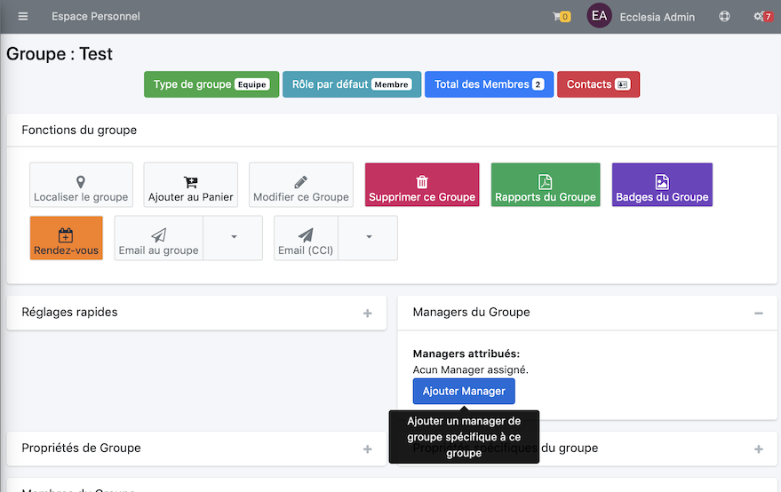
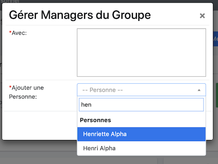

# 
<big>Gestion d'un groupe & Ecclesia**CRM** </big>

Un manager de groupe peut ajouter ou retirer des membres du groupes ou gérer son groupe.

Un manager peut être défini de manière 

- Globale : ce manager pourra définir l'appartenance d'un membre pour tous les groupes
- Locale  : on peut ici définir un manager que pour un groupe spécifique

> Note : un manager de groupe peut ajouter un membre, prééxistant dans le CRM, dans un groupe, mais ne peut créer un membre. Il est possible de qu'une famille s'inscrive de manière automatique dans le CRM (voir pour cela la section famille : auto-inscription).

##Gestion global d'un groupe

Un utilisateur du système peut avoir le rôle : "gestion de groupe"

Pour cela 

On édite un des utilisateurs

On lui affecte ce rôle

##Gestion local d'un groupe

Il faut dans ce cas sélectionner le groupe pour lequel vous aimeriez ajouter un admin local

On sélection ensuite l'icône "+" qui permet de déployer le volet permettant d'affecter le manager local

On clique ensuite le bouton : "Ajouter Manager"

On pourra ici choisir la personne à affecter.
