# <center><big>Gérer ses campagnes Mailchimp sous Ecclesia**CRM** </big></center>

**IMPORTANT** pour la gestion des images, le gestionnaire de fichier doit pointer sur le dossier publique.

En effet, toutes les images insérées dans la campagne doivent avoir des liens publiques et non privés.

## Créer sa première campagne

On utilise le bouton suivant

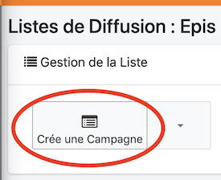

Avec la boite de dialogue

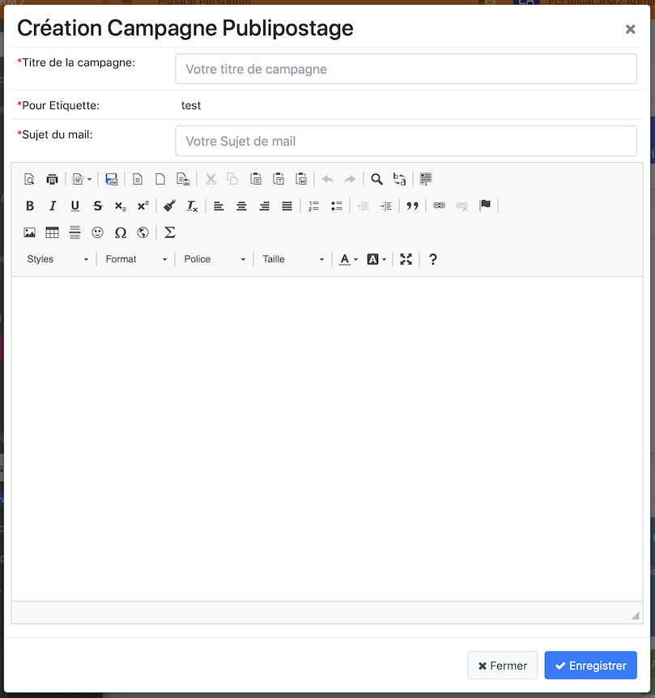

Vous pourrez saisir le titre de votre campagne et le sujet du mail

## Gestion d'un Mail type (code champ : publipostage)

Il est maintenant d'utiliser les codes champs de Mailchimp, un code champ permet de faire des mail type comme des lettres types (ce que l'on appelle communément le publipostage).

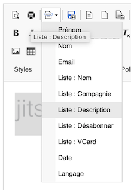

L'exemple ci-dessous, inclus FNAME (le prénom), LNAME (le nom) la date de création d'envoi du mail.

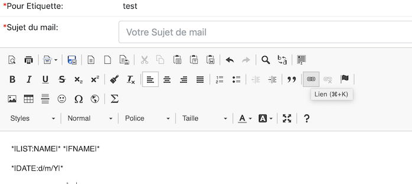

Quand la campagne sera envoyée, les prénoms, noms de chaque utilisateurs seront substitués à la place de chaque code champ.

- Il est possible de mettre en place le lien de désabonnement par rapport à la liste de diffusion<br>
Pour cela, on utilise le code champ<br>
 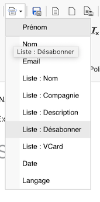<br>
On obtient<br>
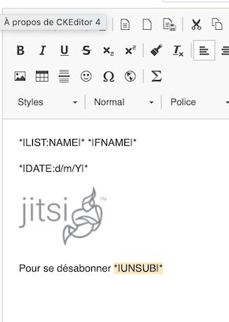<br>
On sélectionne le lien ````*|UNSUB|*```` et on utilise le bouton <br>
 <br>
On obtient<br>
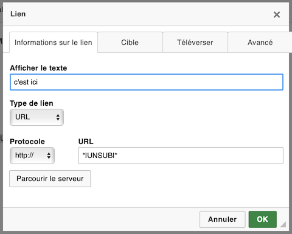

Puis on valide par "Ok".

**Remarque** Dans les réglages généraux, il est possible de rajouter l'adresse et le numéro de téléphone de chaque utilisateur.

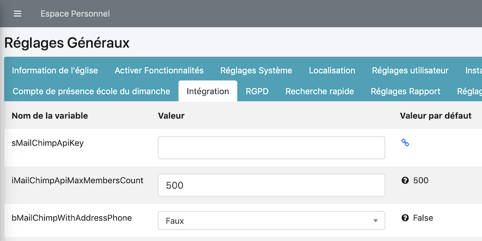

## Insérer des Images ou des Documents

Vous pourrez insérer des images ou des documents

- par glisser déposer dans la zone de texte
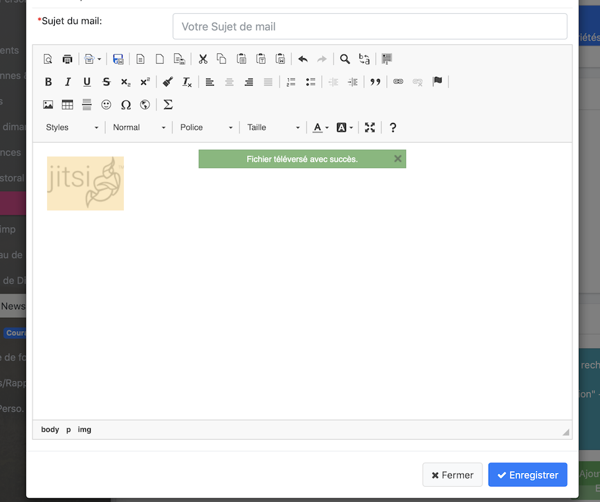<br>
Vous constaterez en double-cliquant sur l'image, que le lien est publique et pointe sur le dossier de l'utilisateur courant dans un conteneur sous forme UUID
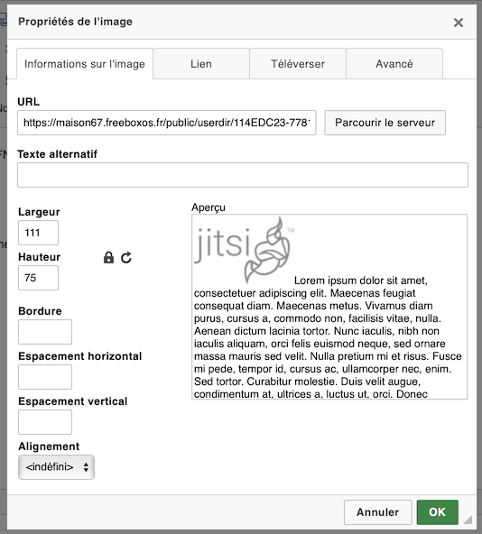<br>
Vous pourrez ici, changer la taille de l'image.
- ou par le gestionnaire de fichier via le fait d'insérer des images.<br>
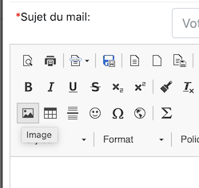<br>
Une boite de dialogue<br>
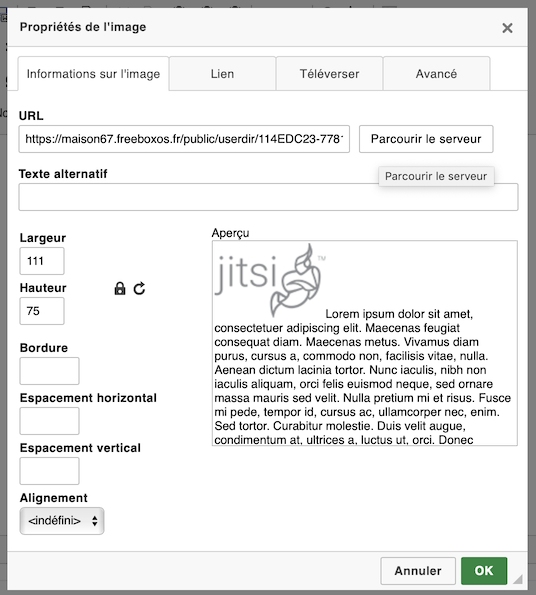<br>
On clique le bouton "Parcourir le serveur"<br>
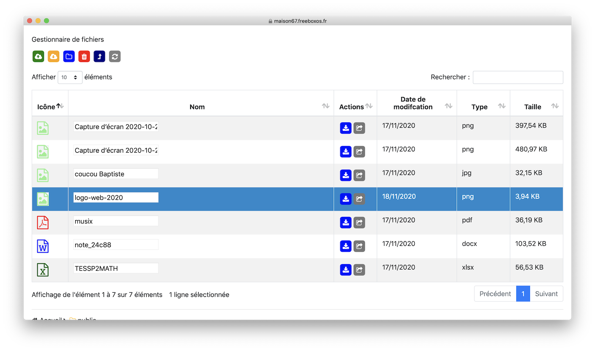<br>
On obtient le gestionnaire de fichier<br>
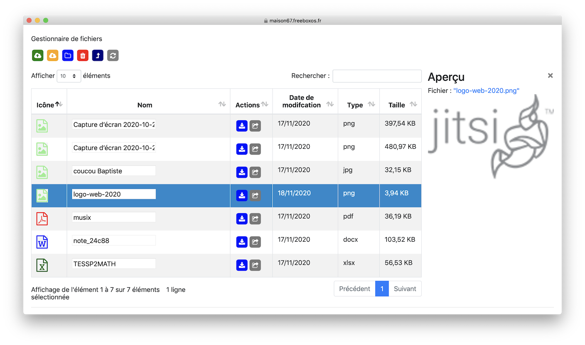<br>
On peut télécharger une image sur le serveur<br>
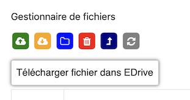<br>
On sélectionne le fichier à insérer dans le document<br>
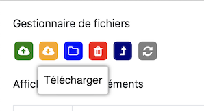<br>

- par glisser-déposer de fichier, très utile pour télécharger un document en pièce jointe dans le mail
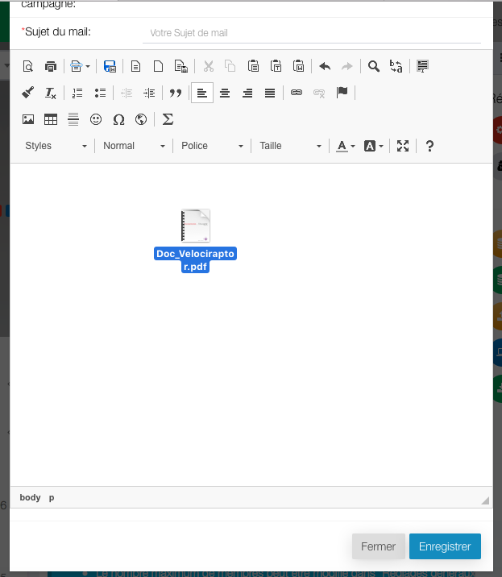<br>
Voici la pièce jointe<br>
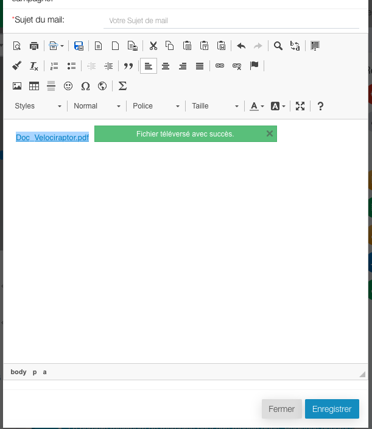<br>

Une fois la campagne finalisée, vous pourrez "Enregistrer" votre campagne.

## Planifier vos envois de Mails

Pour cela, il faut enregistrer vos mails, vous serez basculer sur la page d'envoi

<br>
<br>
Ici pour pourrez, enregistrer, envoyer, supprimer ou fixer une date et une heure pour votre campagne.<br>
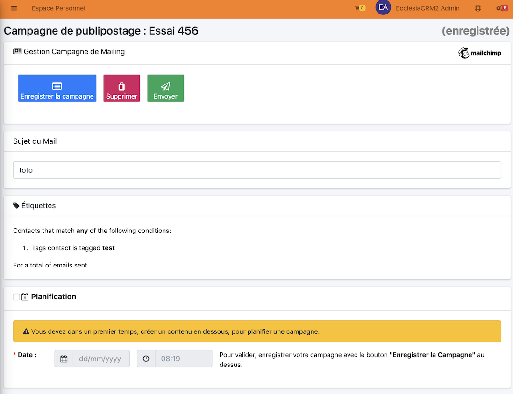<br>

Il sera possible aussi de la modi

