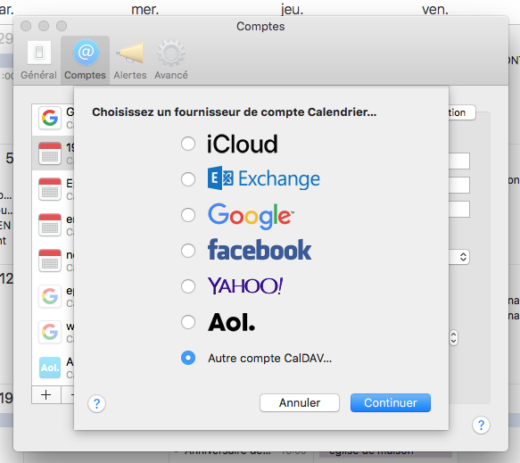
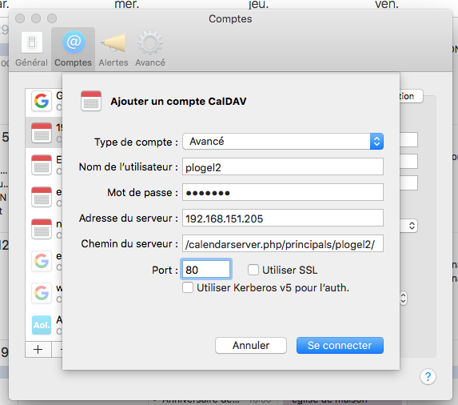
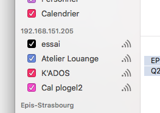

Un calendrier peut-être partagé avec un Mac ou un iPhone ou encore avec Thunderbird.

EcclesiaCRM est compatible CalDAV 

## Partager un calendrier sous Mac

1. Ouvrir Calendar sur Mac et ajouter un nouveau calendrier
       
       

2. Les paramètres sont les suivants, vous devrez renseigner le login utilisateurs sous EcclesiaCRM
    
       

4. Voici le résultat

       
       
    - Vous pourrez ajouter des événements, si le calendrier est accessible en écriture.
    - tout sera ensuite répercuté sous Mac.
    
## Partager un calendrier sous iOS

la démarche est la même que sous Mac.

Il faut renseigner l'url sous la forme :  http://192.168.151.205/calendarserver.php/principals/plogel2/

## Partager sous Thunderbird

- Dans un premier temps, il faut récupérer l'adresse du calendrier

       
       
- Vous pourrez sélectionner cette adresse et la mettre dans Thunderbird.

- Défaut, il faut le faire pour chaque calendrier.

## Pour Outlook, il faut un connecteur comme pour Zimbra.

Vous pourrez le télécharger ici par exemple : 

```https://sourceforge.net/projects/outlookcaldavsynchronizer/```


## Remarques

- De même avec les calendriers groupes et partagés.
- Un calendrier groupe ne peut être rajouté que par un admin.

